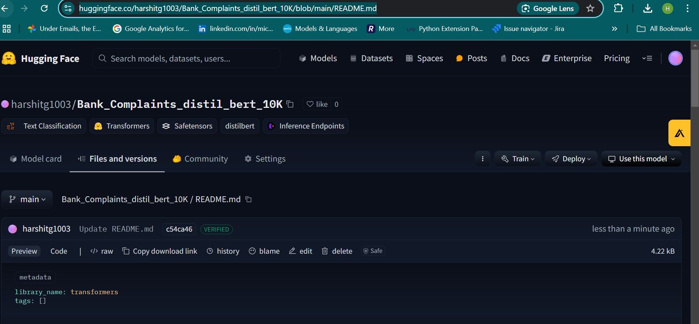

# Transformer-Based Customer Complaint Analysis 🚀  

This project leverages **Hugging Face’s distilbert-base-uncased model** to analyze customer complaints, providing actionable sentiment insights and helping businesses prioritize and resolve issues effectively.  

---

## Features  

- **End-to-End Sentiment Analysis**:  
  - Classifies customer feedback into positive, neutral, or negative sentiments.  
  - Example:  
    Input: *“Overheating issue, don’t buy this product—camera was good!”*  
    Output: `{'label': 'NEGATIVE', 'score': 0.95}`  

- **Device-Optimized Performance**:  
  - GPU acceleration using CUDA for faster inference.  

- **Practical Dataset Exploration**:  
  - Trained and evaluated on real-world complaint datasets to improve insights.  

---

## Getting Started  

### Installation  

1. Clone the repository:  
   ```bash
   git clone https://github.com/harshitgupta1998/Transformer-Based-Customer-Complaint-Model.git
   cd Transformer-Based-Customer-Complaint-Model


https://huggingface.co/harshitg1003/Bank_Complaints_distil_bert_10K/blob/main/README.md
## Model Deployment 

